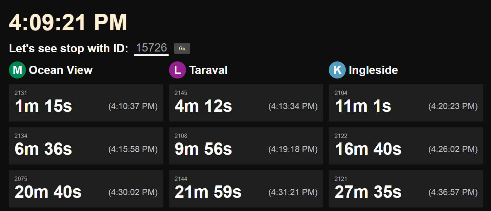

# muni-track

## Preview

**<https://muni.kenjiang.ca>**


## Abstract

Lightweight MUNI arrival tracker. Big emphasis on the "lightweight". Displays all MUNI arrivals in real time for a given stop.

0 production dependencies. Developed in TypeScript, bundled using Vite, deploying with GitHub Pages. Uses vanilla HTML and CSS in an effort to minimize bundle size.

Stop IDs can be found at <https://www.sfmta.com/routes/>

This site requires you to input a 511 API key. Mint a free API key at <https://511.org/open-data/token>.

> **You may get rate limited** with the default limits (60 requests per hour). This page is intended to be opened occasionally throughout the day to check for short term arrivals. Using this like a 24/7 arrivals board mounted on your wall will require you to request for a [rate limit increase](https://511.org/about/faq/open-data#:~:text=I%20am%20receiving%20rate%20limit%20error.)

## Development

```sh
npm i
npm run dev
```
